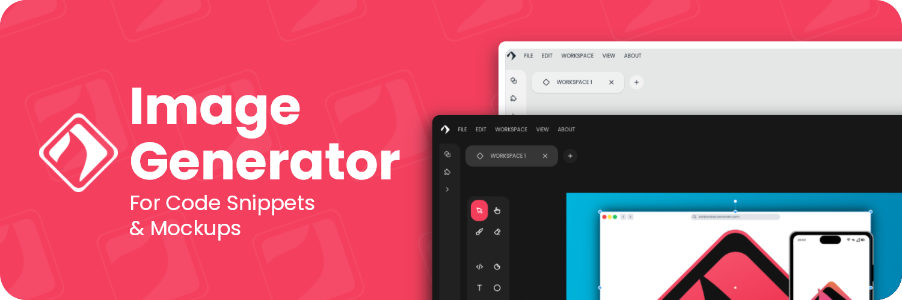

<h3 align="center">Hi! 👋 I am Yoannis Sánchez Soto</h3>

I like **ReactJS**, **Linux** and make a new **Side Project** every week 😁 *(Its a joke don't worry)*. 🛠️ I’m currently working on [Karbonized](https://www.github.com/yossTheDev/karbonized)



*and the rest of time...*

``` python
for days in life:
    if time_to_sleep():
        sleep()
    else:
        code()    
```

*but you may see my other projects:*

* [YALA](https://github.com/yossTheDev/yala): A package manager for Arch-based Linux Sytems

* [Prossa](https://github.com/yossTheDev/prossa): Web-based ebook reader made with VueJS

<h3 align="center">🤩 Fav Tech Stack</h3>

<div align="center">


<h3> 🤝 Connect with me</h3>

<p align="left">
<a href="https://t.me/yossthedev" target="blank">
</a>
</p>

<p align="left">
<a href="https://twitter.com/yossthedev" target="blank">
</a></p>

<p align="left">
<a href="https://threads.net/@yossthedev" target="blank">
</a></p>

<p  align="left">
<a href="mailto:yossthedev@gmail.com" target="blank">
</a></p>
