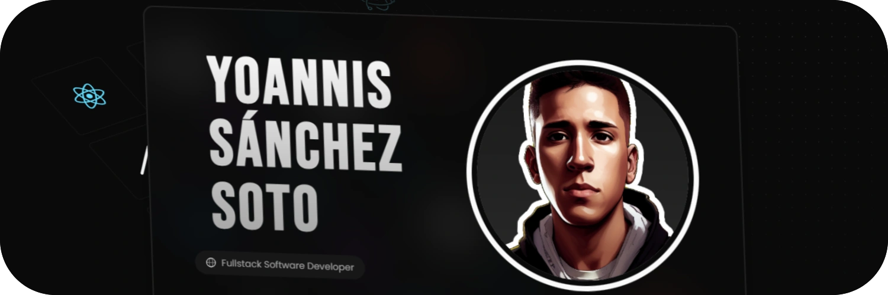

<h1 align="center">Hi! 👋 I'm Yoannis Sánchez Soto (Yoss)</h1>

<p align="center">
 <b> 🎨 Web Developer </b>  |  <b>💻 Linux Enthusiast</b>  |  <b> 🚀 Side Project Fanatic</b>
</p>

---

### 🛠️ What I’m Working On

I’m currently focused on building amazing tools like:  

- [**Karbonized**](https://github.com/yossTheDev/karbonized): An Electron-based application for creating beautiful code snippets.  
    
- [**Organized**](https://github.com/yossTheDev/organized): A TypeScript CLI to automatically organize your folders by file type.  
    

---

### 💡 Fun Fact  

I always joke about starting a new side project every week... but only *sometimes* it’s a joke. 😅  

Here’s how my life usually looks:  

```python
for days in life:
    if time_to_sleep():
        sleep()
    else:
        code()
```

---

### 📚 Other Projects You Might Like  

- [**YALA**](https://github.com/yossTheDev/yala): A package manager for Arch-based Linux systems.  
- [**Prossa**](https://github.com/yossTheDev/prossa): A web-based ebook reader built with Vue.js.

---

<h3 align="center">✨ My Favorite Tech Stack</h3>

<p align="center">
  
  
  
  
  
  
  
  
  
  
</p>

---

<h3 align="center">📊 Widgets</h3>

<p align="center">
  
</p>

---

<h3 align="center">🤝 Connect with Me</h3>

<p align="center">
  <a href="https://t.me/yossthedev" target="_blank">
    
  </a>
  <a href="https://twitter.com/yossthedev" target="_blank">
    
  </a>
  <a href="https://threads.net/@yossthedev" target="_blank">
    
  </a>
  <a href="mailto:yossthedev@gmail.com" target="_blank">
    
  </a>
</p>
